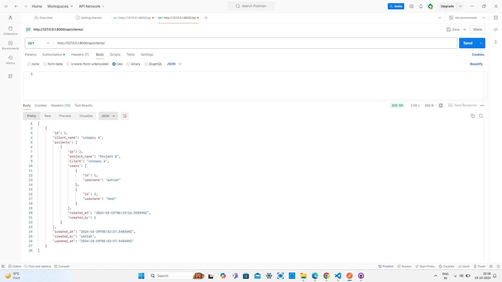
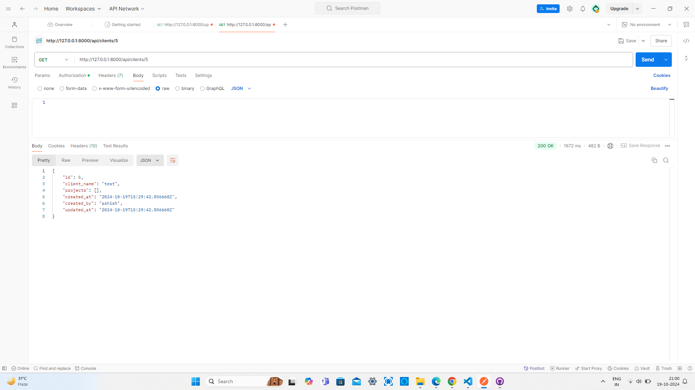
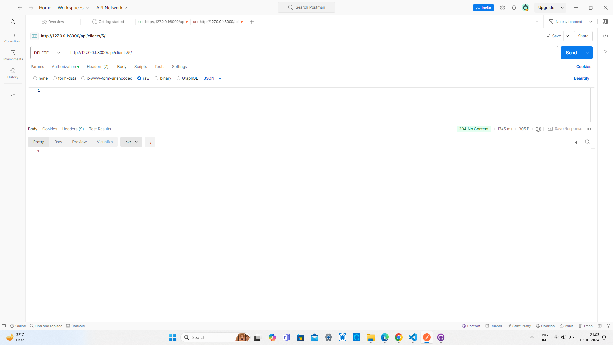
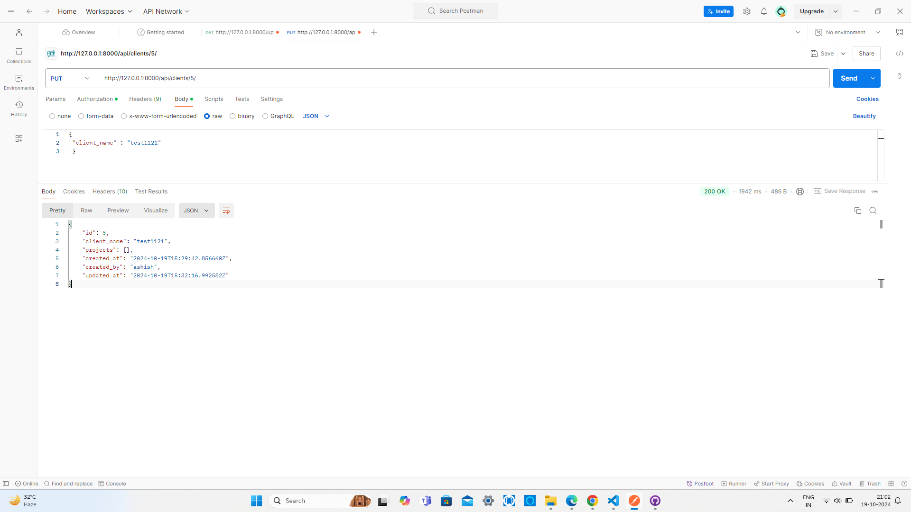
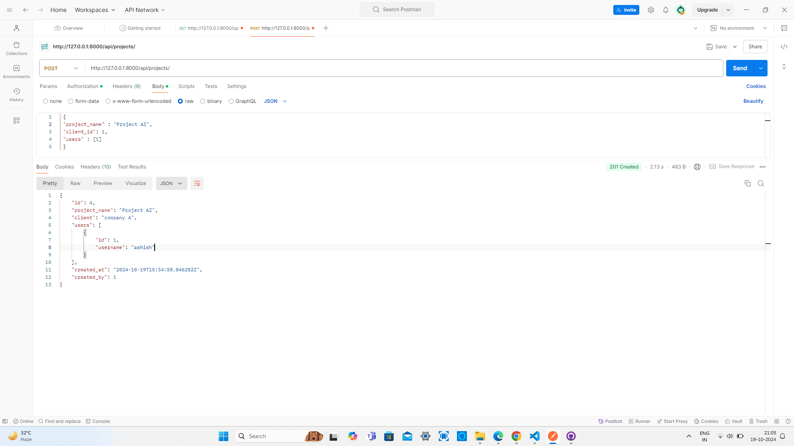
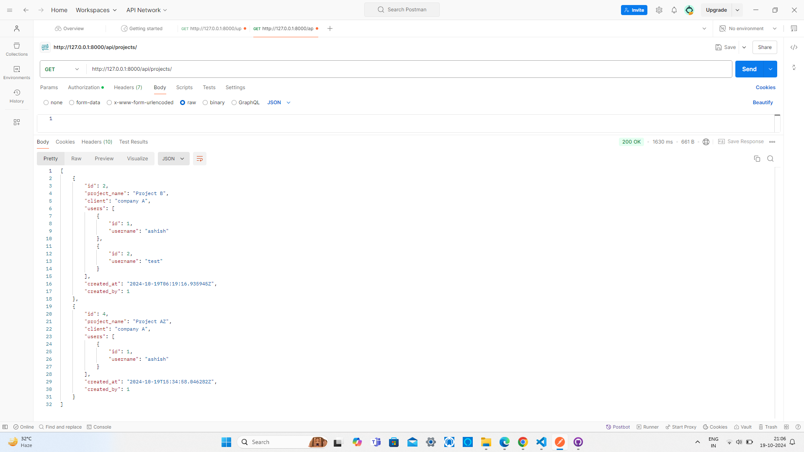
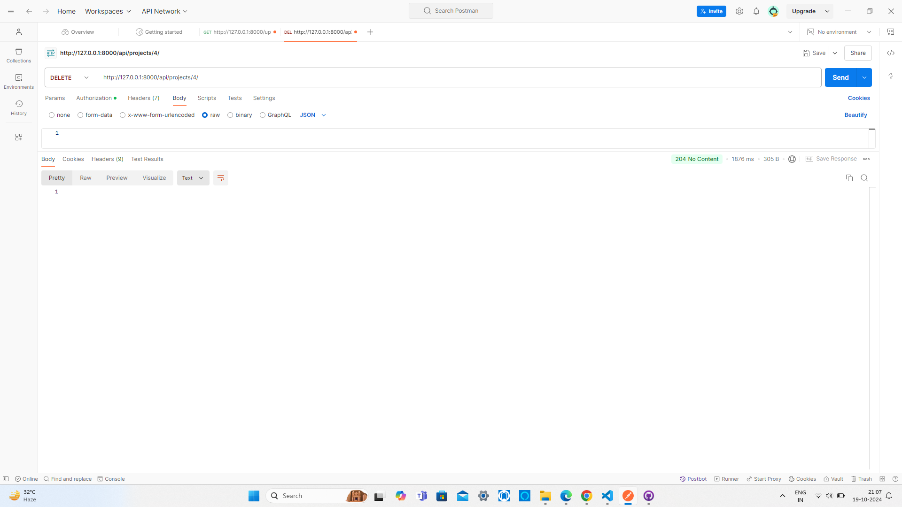

# Project Management Django App

This is a Django application which will use to manage projects with respect to clients and users.

## Features

 1. Register a client
 2. Fetch clients info
 3. Edit/Delete client info
 4. Add newprojects for a client and assign users to those projects.
 5. Retrieve assigned projects to logged-in users

## Installation

1. Clone the repository:

    bash
    git clone https://github.com/Ashish0302-tech/project_management.git
    

2. Navigate to the project directory:

    bash
    cd project_management
    

3. Create a virtual environment:

    bash
    python3 -m venv env
    

4. Activate the virtual environment:

    - On Windows:

        bash
        env\Scripts\activate
        

    - On macOS and Linux:

        bash
        source env/bin/activate
        

5. Install dependencies:

    bash
    pip install -r requirements.txt
    

6. Run migrations:

    bash
    python manage.py makemigrations
    python manage.py migrate
    

7. Start the development server:

    bash
    python manage.py runserver
    

8. Open your web browser and navigate to http://127.0.0.1:8000/admin/ to access the application.

## Snapshots

# User Dashboard
(SnapShots/User Dashboard.png)

# GET clients api

# Post Clients api

# GET Clients api by ID

# DELETE clients api

# PUT clients api

# POST project api

# GET projects api

# DELETE projects api

## Contributing

Contributions are welcome! Please feel free to submit a pull request or open an issue if you encounter any problems or have suggestions for improvements.

## Contact
If you loved what you read here and feel like we can collaborate to produce some exciting stuff, or if you
just want to shoot a question, please feel free to connect with me on 
<a href="mailto:ashishkalwar03@gmail.com">email</a> or 
<a href="https://www.linkedin.com/in/ashish-kalwar/" target="_blank">LinkedIn</a>
